# Nextcloud Production Setup

## Prequiste
1. podman installed
2. internet to fetch contaner images

## Step 1 : Create a Custom Network 
**command**
```
$  podman network create nextcloud-network
```

**output**
```
nextcloud-network
```
## Step 2 : Setup Mariadb container

**command**
```
$ mkdir -p /home/prodadmin/nexcloud-db
```

**command**
```
$ podman run -d --name nextcloud-db \
--network nextcloud-network \
-e MYSQL_ROOT_PASSWORD=nextcloudroot \
-e MYSQL_DATABASE=nextcloud \
-e MYSQL_USER=nextcloud \
-e MYSQL_PASSWORD=nextcloudpassword \
-v /home/govind/nextcloud-db:/var/lib/mysql \
docker.io/library/mariadb:latest
```
**ouput**
```
Trying to pull docker.io/library/mariadb:latest...
Getting image source signatures
Copying blob 597f7afe50fe done   | 
Copying blob 5a7813e071bf done   | 
Copying blob 5db80086e4da done   | 
Copying blob bdecd990c29c done   | 
Copying blob 901fe9394c00 done   | 
Copying blob 43eb19e1b102 done   | 
Copying blob e1dede558384 done   | 
Copying blob 5c3a22df929b done   | 
Copying config a914eff5d2 done   | 
Writing manifest to image destination
603ce54f58ddae20eb0f452934534652e458579a2be9ada6d0d7f45fd54ad2cc
```
## Step 3 : Setup Nextcloud container

**command**
```
mkdir -p /home/prodadmin/nextcloud-data
```

**command**
```
$ podman run --name nextcloud \
--network nextcloud-network \
-p 3035:80 \
-e MYSQL_HOST=nextcloud-db \
-e MYSQL_DATABASE=nextcloud \
-e MYSQL_USER=nextcloud \
-e MYSQL_PASSWORD=nextcloudpassword \
-v /home/govind/nextcloud-data:/var/www/html \
-d docker.io/library/nextcloud:latest
```
**output**
```
Trying to pull docker.io/library/nextcloud:latest...
Getting image source signatures
Copying blob ea823f46cc3c done   | 
Copying blob 814b6ecb84b0 done   | 
Copying blob b545bb7ff18e done   | 
Copying blob c29f5b76f736 done   |
Copying blob 8ca47539e139 done   | 
Copying blob a4e58aa84c36 done   | 
Copying blob bcbecb454049 done   | 
Copying blob 68d70c2b9fc9 done   | 
Copying blob b9903ecbcf0b done   | 
Copying blob f473bcbd0e44 done   | 
Copying blob d8b79b64a9d5 done   | 
Copying blob 5c36aa47b3f5 done   | 
Copying blob c6834909cd19 done   | 
Copying blob 4f4fb700ef54 done   | 
Copying blob 2165e16fdfc8 done   | 
Copying blob fe4c7c7b0f74 done   | 
Copying blob e553263d7367 done   | 
Copying blob c02eac726b6f done   | 
Copying blob 43c2e5ccaa45 done   | 
Copying blob 0f296d92939e done   | 
Copying blob b62640bae4b9 done   | 
Copying blob d5fc66f9f2b8 done   | 
Copying config c10492ea73 done   | 
Writing manifest to image destination
b6d226e671177e9454e129482c70e6335a47f0452ac19720e47e954eecc238ae
```

Access the Nextcloud web UI at http://serverip:3035 

Create a account with following credentials:   
Username: admin  
Password: admin

click on install as shown below.

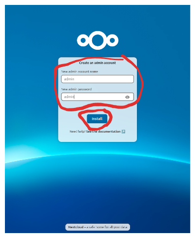

click on Skip as shown below  
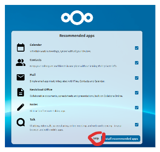


## Step 4 : Setup Minio container

**command**
```
$ mkdir -p /home/prodadmin/minio-data
```

**command**
```
$ podman run -d --name minio \
--network nextcloud-network \
-p 9001:9001 \
-e MINIO_ROOT_USER=admin \
-e MINIO_ROOT_PASSWORD=admin123 \
-v /home/prodadmin/minio-data:/data      docker.io/minio/minio server /data --console-address ":9001"
```
**output**
```
Trying to pull docker.io/minio/minio:latest...
Getting image source signatures
Copying blob 9f6e39204980 done   | 
Copying blob f85b91ff2bfd done   | 
Copying blob 35e180fc9c9b done   | 
Copying blob 2c2d0fc1bc01 done   | 
Copying blob f1560539221a done   | 
Copying blob e3a2c2426f91 done   | 
Copying blob de107ff92ad1 done   | 
Copying blob 4185a80fc2d9 done   | 
Copying blob 3813b8582772 done   | 
Copying blob 69c6bf522b83 done   | 
Copying config 682b4acfc9 done   | 
Writing manifest to image destination
0aab92743b02eb6a0c11a04577a5ce0c9b1ec6e96180cec8f79f418f0e81198c
```
Access the MinIO web UI at http://serverip:9001  

Use the credentials:   
Username: admin  
Password: admin123  

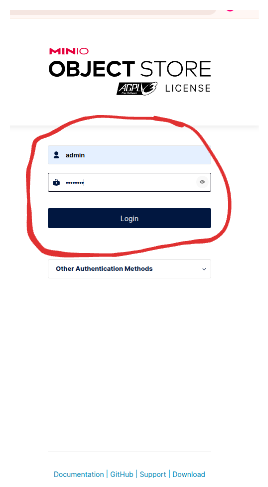


## Step 5 : Setup keycloak Container

**command**
```
podman run -d --name keycloak \
--network nextcloud-network \
-p 8080:8080 \ 
-e KC_BOOTSTRAP_ADMIN_USERNAME=admin \ 
-e KC_BOOTSTRAP_ADMIN_PASSWORD=admin \ 
quay.io/keycloak/keycloak:26.1.2 start-dev
```

**output**
```
Trying to pull quay.io/keycloak/keycloak:26.1.2...
Getting image source signatures
Copying blob 1aa6971d2e3b done   | 
Copying blob f85b91ff2bfd done   |
Copying blob 06b1eb356a90 done   | 
Copying blob f7f68c756bc0 done   | 
Copying blob e3a2c2426f91 done   |
Copying config 32abf50e47 done   | 
Writing manifest to image destination
de5ceabddbaeb753417040ee24e383494985b7a0ab2bf7b2f0195ca567e78d92
```

Access the keycloak web UI at http://serverip:8080  

Use the credentials:   
Username: admin  
Password: admin

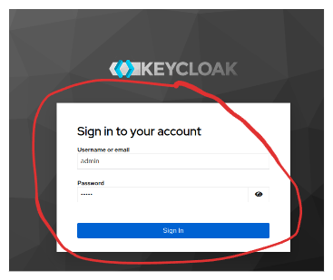

## Step 6 : Setup 389DS LDAP container

**command**
```
$ mkdir -p /home/prodamin/389ds-data
```

**command**
```
$ podman run -d --name 389ds_ldap --network nextcloud-network -e DS_DM_PASSWORD=nextcloud -v /home/prodadmin/389ds-data:/data  --security-opt label=disable  docker.io/389ds/dirsrv:latest
```

**output**
```
Trying to pull docker.io/389ds/dirsrv:latest...
Getting image source signatures
Copying blob b883052989bb done   | 
Copying blob 1a32d70fd667 done   | 
Copying config 20068aa3f2 done   | 
Writing manifest to image destination
7fe0b05cce0013d88df4e8df574b8aab32aea8a9383e130a20cfaf95f07fa819
```

### Step 7 : Create S3 Bucket and Access key in Minio.
Access the Minio Web Interface.

Click on Create Bucket button as below. 

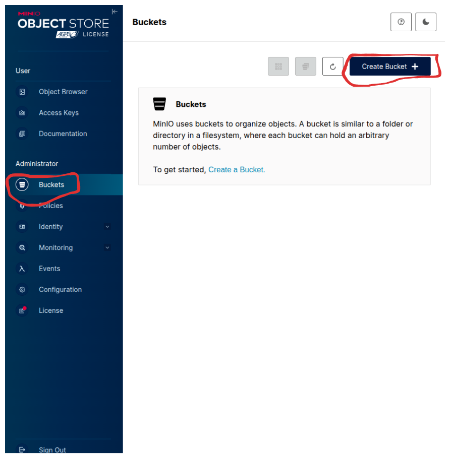

Fill in the Bucket Name (nextcloud) and  clik on Create Bucket.  

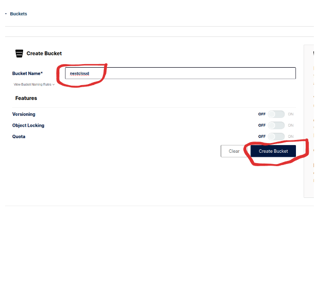


Click on Create access key as show below.
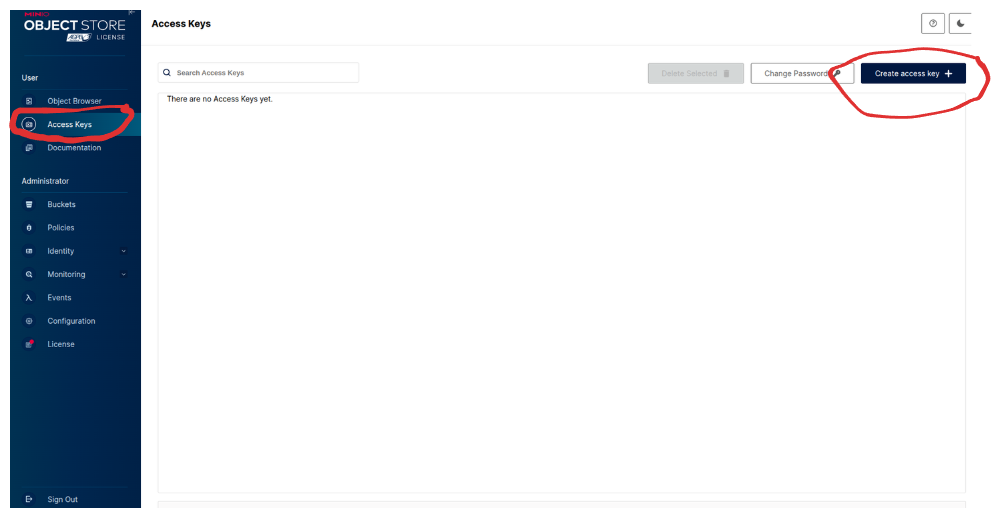

Clik on create button as shown below.
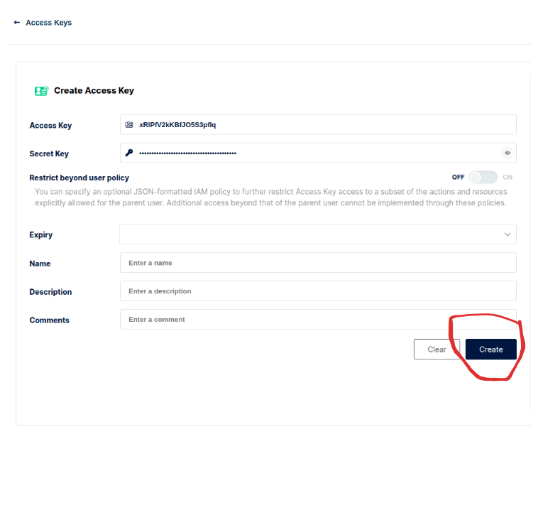

Copy and save the access the access key and  secret key, we need them to later for configuring with Nextcloud.
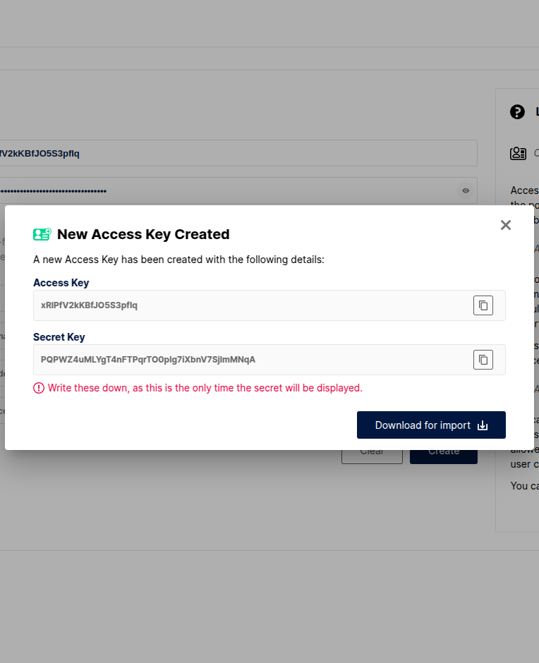

## Step 8 : Configuring Minio Bucket with NextCloud.

Access the Nextcloud Dashboard.

click on the profile icon as shown below.
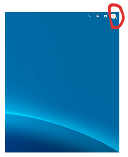


click on app button as shown below.  
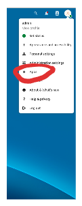

click on disable apps button as shown below.    
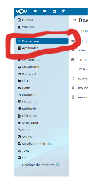

click on enable button as shown below to enable external storage support.  
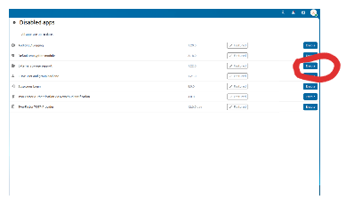

Enter your admin password and confirm as shown below.
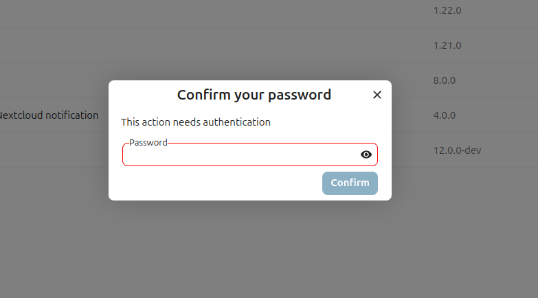


click on the profile icon as we have done previously.

click on administration setting button as shown below.
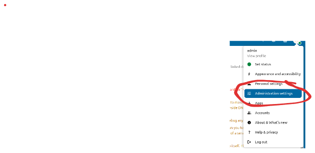

click on External Storage button.  
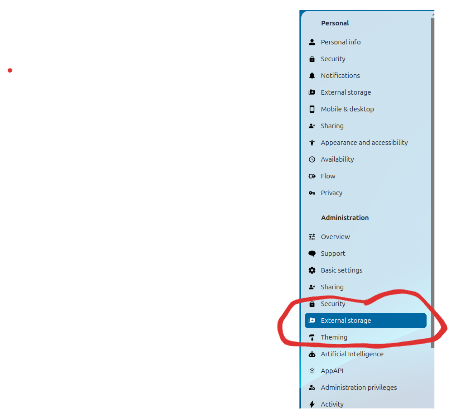


Fill some details as shown below  
Folder name: /   
External Storage: Amazon S3

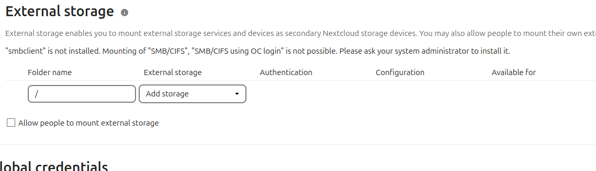

Fill some more details as shown  
authenication: access key   
configuration :  
nextcloud  
minio  
9001

enable ssl: untick this
enable path style : tick this option
accesskey: minio access key
secret key: minio secret key

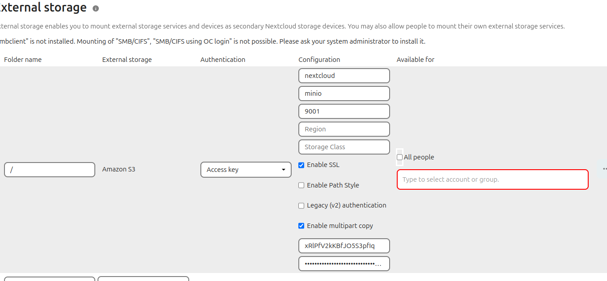

click on All people and confirm your password to check mark this.


click on check sign on right side and then confirm your admin password as shown below 
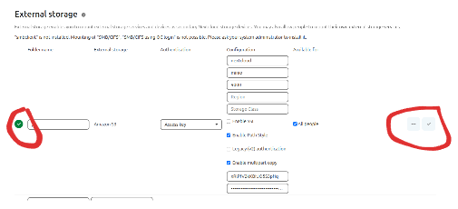

Green colour tick on left side confirms the configuration is done correctly.

### Step 9: Add SSO in NextCloud using keycloak
